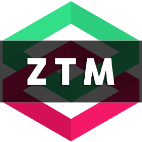

# A.I.-Machine-Learning-Data-Science-Bootcamp-ZTM

  

    <a href="#roadmap">Roadmap</a>
  • <a href="#techs">Tecnologias</a> 

---

<h3  id="techs">Tecnologias:</h3>

     
  </ul>
   

# ZTM - A.I. Machine Learning| Data Science

<h3>Roadmap:</h3>

 
  <ul>
    <h3>Pandas: Data Analysis </h3>
    

    <h3> Numpy
    <h3> Matplotlib
    <h3> Scikit-learn
    <h3> TensorFlow
    <h3> Storytelling
  </ul>

